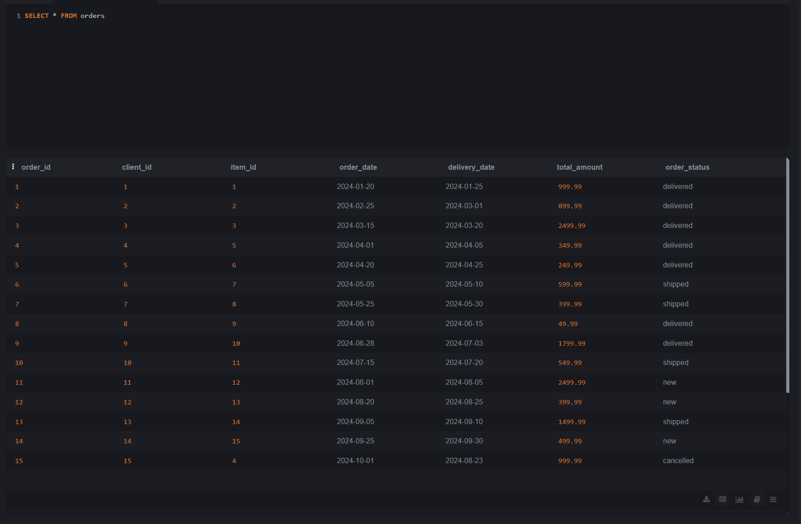
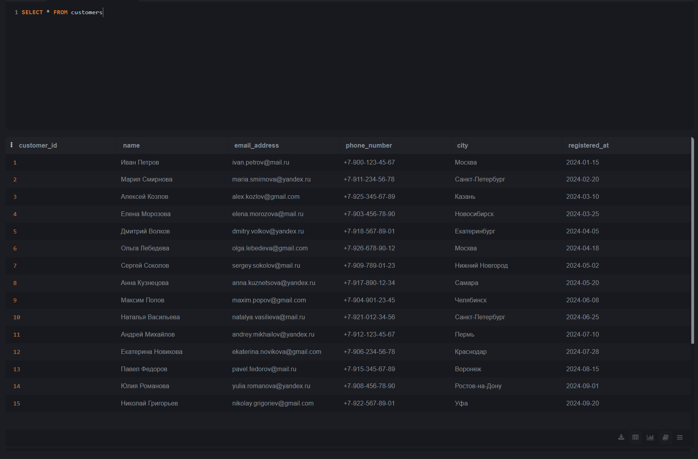
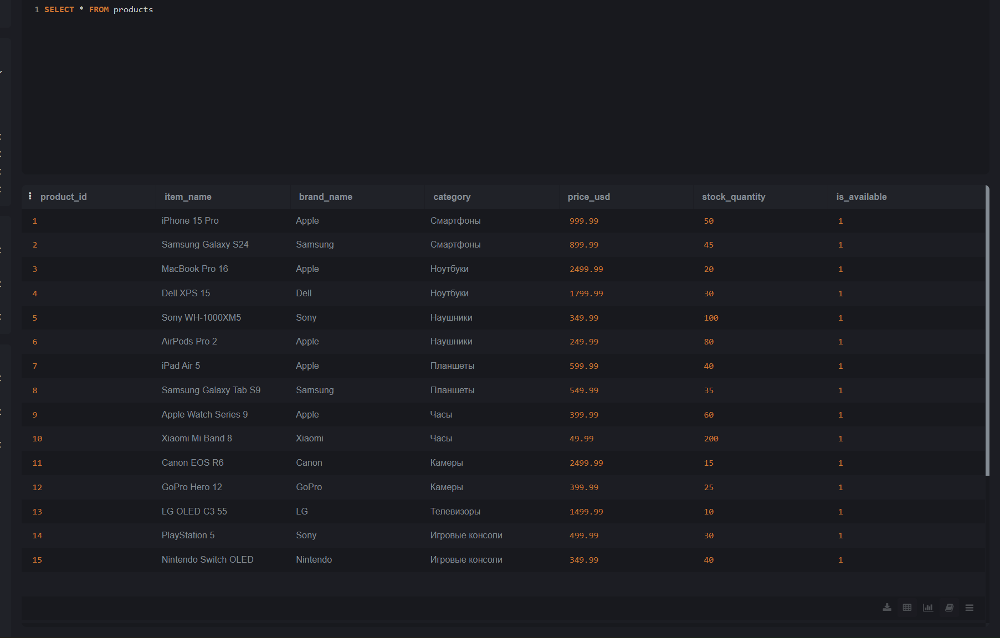

# 📦 База данных "Магазин электроники"

## Описание проекта

Данный проект представляет собой реляционную базу данных для интернет-магазина электроники. 
База данных разработана на **SQLite** и содержит информацию о клиентах, товарах и заказах.

## 🗄️ Структура базы данных

### Таблица `customers` (Клиенты)

| Поле | Тип | Описание |
|------|-----|----------|
| customer_id | INTEGER | Уникальный идентификатор клиента  |
| name | TEXT | ФИО клиента |
| email_address | TEXT | Email (уникальный) |
| phone_number | TEXT | Номер телефона |
| city | TEXT | Город проживания |
| registered_at | TEXT | Дата регистрации |

### Таблица `products` (Товары)

| Поле | Тип | Описание |
|------|-----|----------|
| product_id | INTEGER | Уникальный идентификатор товара  |
| item_name | TEXT | Название товара |
| brand_name | TEXT | Бренд |
| category | TEXT | Категория товара |
| price_usd | REAL | Цена в долларах |
| stock_quantity | INTEGER | Количество на складе |
| is_available | BOOLEAN | Доступность товара |

### Таблица `orders` (Заказы)

| Поле | Тип | Описание |
|------|-----|----------|
| order_id | INTEGER | Уникальный идентификатор заказа |
| client_id | INTEGER | ID клиента (customers) |
| item_id | INTEGER | ID товара (products) |
| order_date | TEXT | Дата заказа |
| delivery_date | TEXT | Дата доставки |
| total_amount | REAL | Сумма заказа |
| order_status | TEXT | Статус заказа (new/shipped/delivered/cancelled) |

### Картинки работы программы с визуализацией таблиц

#### Таблица `Orders`

#### Таблица `Customers`

#### Таблица `Products`

